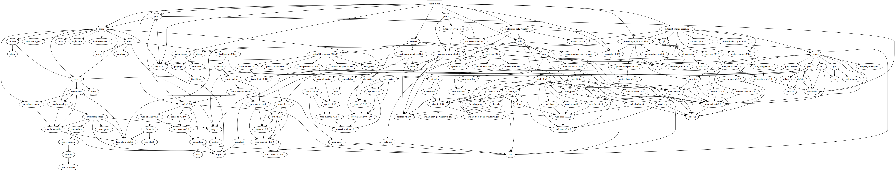

# Vigilant Steel

A space game using [Rust](https://www.rust-lang.org/) & [Piston](http://www.piston.rs/), where ships are made of singular modules that can be attached and destroyed individually.

## Dependencies

specs, Piston, SDL2, gl, and Conrod.

## Goals

* [X] Use a clean Rust architecture, with specs to decouple entity components
* [X] 2D rendering with Piston
* [X] Make a simple game
* [X] Get this to work in the browser with Emscripten as well as on the desktop
* [X] Make it multiplayer
  * [X] Get network working (UDP)
  * [ ] Get network working in the browser (websockets); also needs a websockets server
  * WebRTC is also an option? (has unreliable transport and peer-to-peer)
  * [X] Make headless server builds
* [ ] Make a demo, announce
* [ ] Make a full game I guess

